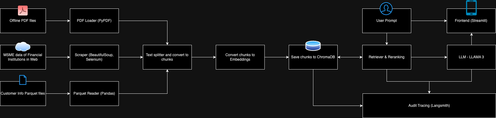

# MSME LOAN ADVISOR #

## Prerequisites
1) create account in OpenAI Platform - https://platform.openai.com/docs/overview
2) create account in Langsmith - https://www.langchain.com/langsmith

## How to setup locally?
1) Download Ollama - https://ollama.com/download
2) Run in terminal: 
    `ollama pull llama3.2` 
    This will download LLAMA 3.2 LLM.
3) Run in terminal:
    `pip install -r requirements.txt`
    This will install the application dependencies.
4) Create .env file with the following variables
    - <b>OPEN_AI_API_KEY</b> (create an account in OPEN AI and retrieve API key)
    - <b>LANGCHAIN_TRACING_V2</b> (create an account in Langsmith and retrieve this key)
    - <b>LANGCHAIN_ENDPOINT</b> (create an account in Langsmith and retrieve this key)
    - <b>LANGCHAIN_API_KEY</b> (create an account in Langsmith and retrieve this key)
    - <b>LANGCHAIN_PROJECT</b> (create an account in Langsmith and retrieve this key)
5) Run the web scraper & parquet reader in the terminal to capture the latest MSME financial information in the web and download the customer loan information provided
    `python jobs/load_to_chroma.py`

## System Architecture & Design

## How to run the application?
1) Run in terminal:
    `streamlit run app.py`
