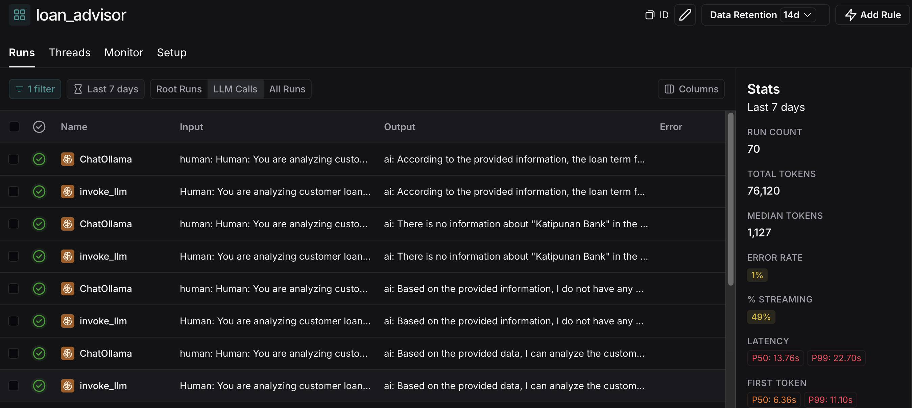
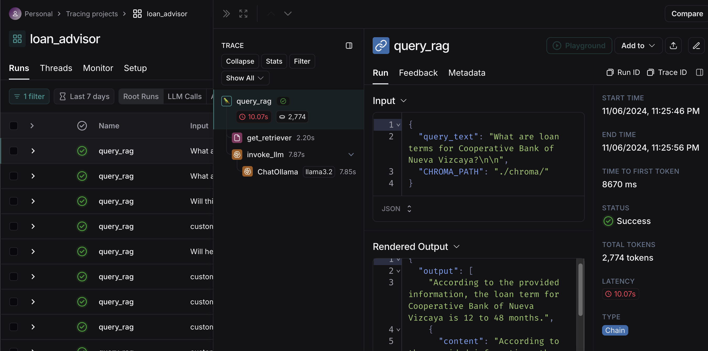

# MSME LOAN ADVISOR #

## Prerequisites
1) create account in OpenAI Platform - https://platform.openai.com/docs/overview
2) create account in Langsmith - https://www.langchain.com/langsmith

## How to setup locally?
1) Download Ollama - https://ollama.com/download
2) Run in terminal: 
    ```
        ollama pull llama3.2
    ``` 
    This will download LLAMA 3.2 LLM.
3) Run in terminal:
    ```
        pip install -r requirements.txt
    ```
    This will install the application dependencies.
4) Create .env file with the following variables
    ```
        OPEN_AI_API_KEY=<insert OpenAPI key here>
        LANGCHAIN_TRACING_V2=<insert Langsmith key here>
        LANGCHAIN_ENDPOINT=<insert Langsmith key here>
        LANGCHAIN_API_KEY=<insert Langsmith key here>
        LANGCHAIN_PROJECT=<insert Langsmith key here>
    ```
5) Run the web scraper & parquet reader in the terminal to capture the latest MSME financial information in the web and download the customer loan information provided
    ```
        python jobs/load_to_chroma.py
    ```

## System Architecture & Design


## How to run the application?
        streamlit run app.py
    


https://github.com/user-attachments/assets/97a1ca95-e686-4a3c-a392-541334f76f2f

## Auditing the LLM results
You can view the logs in Langsmith to backtrack the LLM responses and retrieved data



## Contact us
[Chester Garett Calingacion](chestergarett@gmail.com)<br>
[Andrea Aviles](andrexaviles@gmail.com)<br>
[Angela Samboa](samboaangelag@gmail.com)<br>

## Thanks to
[Eskwelabs](https://www.eskwelabs.com/)<br>
[BPI](https://www.bpi.com.ph/)<br>